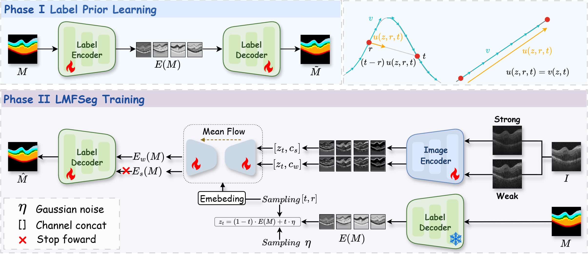

# LSFSeg: Label-Prior-Guided Stable Flow Matching for Retinal Layer Segmentation

Official implementation of **LSFSeg**, introduced in:

> **Make Generative Segmentation Stable: Label-Prior Guided One-Step Flow Matching for Retinal Layer Segmentation in OCT Images**

LSFSeg performs retinal layer segmentation in a pretrained label-latent space. It learns a fixed label prior in Phase I and trains a one-step conditional velocity field in Phase II. The implementation uses the terminology from the paper throughout this document.



## Method Overview

LSFSeg is trained in two phases:

1. **Phase I — Label-prior learning.** The Label Encoder $E_{\mathrm{lab}}$ maps a categorical mask to a four-channel label latent, and the Label Decoder $D_{\mathrm{lab}}$ reconstructs the mask. After pretraining, $E_{\mathrm{lab}}$ is frozen to provide a fixed target for Phase II.
2. **Phase II — Stable Flow Matching.** The Image Encoder $E_{\mathrm{img}}$ maps weak and strong photometric views of an OCT B-scan to their latent conditions. Stable Flow Matching (SFM) predicts the label latent in one step, Global Detail Fusion Modules (GDFMs) transfer multi-scale image detail to $D_{\mathrm{lab}}$, and Dual-View Conditional Trajectory Consistency (DCTC) aligns the predictions from the two image conditions.

At inference time, LSFSeg uses one image view and one network evaluation (NFE = 1). SFM is trained without a forward-mode JVP.

## Paper Terminology and Code Mapping

| Paper name | Symbol | Implementation |
|---|---:|---|
| Label Encoder | $E_{\mathrm{lab}}$ | `network.models.LabelEncoder` |
| Label Decoder | $D_{\mathrm{lab}}$ | `network.models.LabelDecoder` |
| Image Encoder | $E_{\mathrm{img}}$ | `network.models.ImageEncoder` |
| Stable Flow Matching | SFM | `network.models.Denoiser` and `network.training.LSFSegTrainer` |
| Global Detail Fusion Module | GDFM | Frequency-domain skip processing in `network.fourier` and `ImageEncoder` |
| Dual-View Conditional Trajectory Consistency | DCTC | Dual-view augmentation in `network.data` and consistency loss in `LSFSegTrainer` |

## Project Structure

```text
LSFSeg/
├── mgu_stage1.py              # Phase I training and testing entry point
├── mgu_stage2.py              # Phase II training and testing entry point
├── overview.png               # LSFSeg architecture overview
├── network/
│   ├── config.py              # MGU paths, split checks, classes, and palette
│   ├── data.py                # Online resize and DCTC weak/strong views
│   ├── models.py              # E_lab, D_lab, E_img, and SFM denoiser
│   ├── fourier.py             # GDFM frequency-domain operations
│   ├── spatial_transform.py   # Spatial transform utility used by GDFM
│   ├── training.py            # Phase I/II objectives and training loops
│   ├── inference.py           # One-step inference, metrics, and visualization
│   ├── pipeline.py            # Shared training and evaluation workflow
│   └── utils.py               # Shared utilities
├── Data/
│   └── MGU/
│       ├── image/             # Original OCT B-scans
│       ├── label/             # Original categorical masks
│       └── lists/
│           ├── train.txt
│           ├── val.txt
│           └── test.txt
└── output/
    └── MGU/
        └── single_split/
            ├── stage1/
            └── stage2/
```

All paths used by the entry points are relative to the `LSFSeg` project directory.

## Environment

The paper uses Python 3.10 and PyTorch 2.4.0. Install PyTorch for the CUDA version available on your system, followed by the remaining dependencies:

```bash
pip install numpy scipy pillow kornia matplotlib openpyxl tensorboard tqdm
```

## Data Preparation

Place the Glaucoma/MGU split under `Data/MGU` using the structure shown above. Every line in `train.txt`, `val.txt`, and `test.txt` must be the filename of a matching image-mask pair.

Training, validation, and testing read only the source-resolution files in `image/` and `label/`. Model-size conversion is performed in memory; pre-resized image or label caches are not read.

## Quick Start

Run all commands from the `LSFSeg` directory.

### 1. Train Phase I: Label Prior

```bash
python mgu_stage1.py --mode train
```

Phase I trains $E_{\mathrm{lab}}$ and $D_{\mathrm{lab}}$ using masks only.

### 2. Evaluate and Select the Phase I Checkpoint

```bash
python mgu_stage1.py --mode test --test_all
```

This evaluates every complete Phase I checkpoint and writes `selected_stage1.json`. Phase II requires this Dice-based selection metadata.

To test only one checkpoint:

```bash
python mgu_stage1.py --mode test --no-test_all --weight_tag best_epoch
```

### 3. Train Phase II: SFM + GDFM + DCTC

```bash
python mgu_stage2.py --mode train
```

Phase II freezes $E_{\mathrm{lab}}$, trains $E_{\mathrm{img}}$, the SFM denoiser, and $D_{\mathrm{lab}}$, and applies DCTC to weak and strong photometric views. The best checkpoint is selected by decreasing validation segmentation loss and overwrites the existing `best_epoch` checkpoint group.

### 4. One-Step Testing

```bash
python mgu_stage2.py --mode test --weight_tag latest
```

To evaluate all complete Phase II checkpoints:

```bash
python mgu_stage2.py --mode test --test_all
```

Use `--no-save_predictions --no-save_denoise_visuals` when only numerical metrics are required.

Run either entry point with `--help` to view every available parameter.

## Checkpoints and Results

The Phase II best checkpoint consists of four component files:

```text
labelEncoder_best_epoch.pt
labelDecoder_best_epoch.pt
imageEncoder_best_epoch.pt
denoiser_best_epoch.pt
```

Only the checkpoint with the lowest validation segmentation loss is retained during Phase II training. Testing writes per-class and aggregate metrics to the configured Excel file and optionally saves categorical predictions and latent-process visualizations.

## Citation

If this repository is useful in your research, please cite the accompanying paper:

> *Make Generative Segmentation Stable: Label-Prior Guided One-Step Flow Matching for Retinal Layer Segmentation in OCT Images.*
